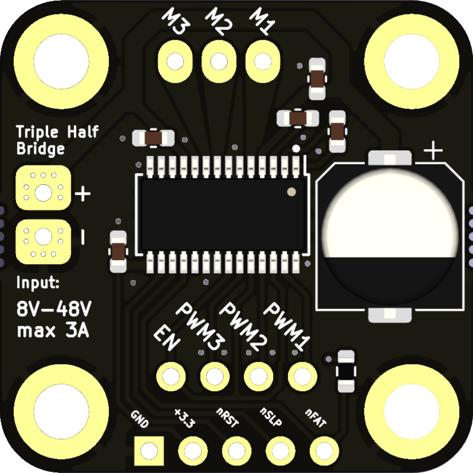
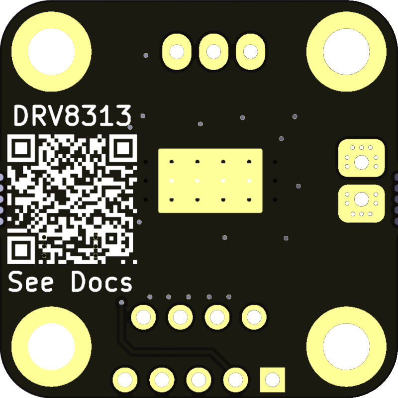

# DRV8313-Breakout
This is an unofficial Breakout Board for the <a href="https://www.ti.com/product/DRV8313" target="_blank" rel="noopener noreferrer">Texas-Instruments DRV8313 Triple-Half-Bridge Motor Driver IC</a>

## <a href="https://www.ebay.de/itm/384936164923?hash=item599ffbbe3b:g:I74AAOSwUhFin4ep" target="_blank" rel="noopener noreferrer">Where to get it?</a>
- <a href="https://www.ebay.de/itm/384936164923?hash=item599ffbbe3b:g:I74AAOSwUhFin4ep" target="_blank" rel="noopener noreferrer">eBay</a> (EU shipping only)
- more platforms may follow soon

## Specs
| Property                   | Value        |
|----------------------------|--------------|
| Input Voltage              | 8V - 48V     |
| Input Current (peak)       | 3A           |
| PWM Phase Inputs           | 3            |
| Enable Pin                 | 1            |
| Reset Pin                  | yes          |
| Sleep Pin                  | yes          |
| Fault Indication Pin       | yes          |
| Output Motor Phases        | 3            |
| Output to Supply Your MCU  | 3.3V         |


## Hardware
| PCB Top                                                   | PCB Bottom
|-----------------------------------------------------------|-----------------------------------------------------------------|
|  |  |

<br/><br/>

# Example with RaspberryPi Pico
In this simple example, the DRV8313 breakout board is used together with a <a href="https://www.raspberrypi.com/products/raspberry-pi-pico" target="_blank" rel="noopener noreferrer">RaspberryPi Pico</a> to drive a brushless gimbal motor in an open loop configuration. Open loop means that we have no feedback on the motor angle. The motor is driven similar to a stepper motor with open loop control.<br/>
Three 120° phase shifted sine waves are fed in via the PWM pins of the microcontroller. The DRV8313 motor driver now amplifies the incoming PWM signal and uses it to drive the motor.<br/>
The output voltage to the motor depends on the input voltage of the DRV8313 and the duty cycle of the PWM signal.

## Wireing


## MicroPython Code
```python
from machine import Pin, PWM
import math
import time


############################################################
# Note: all following service pins are inverted            #
#       therefore the 'n' meaning 'not' before their names #
############################################################
nFault = Pin(6, Pin.IN)   # not-Fault input

nSleep = Pin(7, Pin.OUT)  # not-Sleep output
nSleep.on()               # set to on to not activate sleep mode

nReset = Pin(8, Pin.OUT)  # not-Reset output
nReset.on()               # set to on to not reset the driver


# definition of enable and PWM pins
en = Pin(5, Pin.OUT)  # enable pin
en.on()               # set to on to enable the driver

pwm0 = PWM(Pin(2))    # PWM phase 1 pin
pwm0.freq(20000)      # frequency set to 20kHz (above the audible range)

pwm1 = PWM(Pin(3))    # PWM phase 2 pin
pwm1.freq(20000)

pwm2 = PWM(Pin(4))    # PWM phase 3 pin
pwm2.freq(20000)


##############################
# Custom Parameters          #
# adapt these to your needs! #
##############################
n = 1.0     # number of motor rotations
pp = 7      # number motor of pole pairs
pv = 1.0    # percent of input voltage (e.g. input is 24V; motor needs 12V; -> pv=0.5)
res = 200   # resolutoin/steps per field rotation


# definition of some constants and variables
step = (2*math.pi)/res  # step angle; amount of which the field angle is increased every loop
scale = 0.5*pv          # scaling factor for the sine wave
phi = 0.0               # angle of the electromagnetc field

# main loop
for i in range(int(n*pp*res)):
    phi = phi + step
    
    a = 65535 * (scale * math.sin(phi) + 0.5)
    b = 65535 * (scale * math.sin(phi+2.094395) + 0.5)
    c = 65535 * (scale * math.sin(phi+4.188790) + 0.5)
    
    pwm0.duty_u16(int(a))
    pwm1.duty_u16(int(b))
    pwm2.duty_u16(int(c))
    
    time.sleep_ms(1)  # adjust rotation speed


# after the loop finished after n number of rotations
en.off()   # turn off the motor driver
```

<br/><br/>

# What's next?
If you want to go deeper into the topic of BLDC motor control, you should definitely check out the awesome <a href="https://docs.simplefoc.com" target="_blank" rel="noopener noreferrer">simpleFOC</a> project!<br/>
You can use this DRV8313 breakout board perfectly as a suitable <a href="https://docs.simplefoc.com/bldcdriver3pwm" target="_blank" rel="noopener noreferrer">BLDC motor driver</a>.
