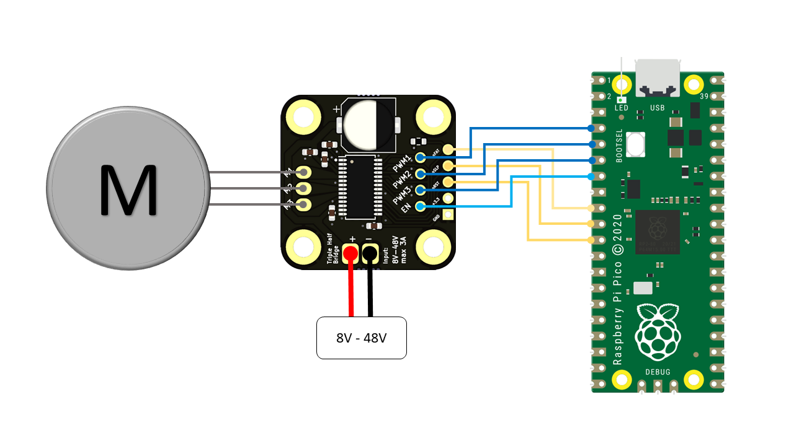

# DRV8313-Breakout
This is a Breakout Board for the Texas-Instruments DRV8313 Triple-Half-Bridge Motor Driver IC

## <a href="https://www.ebay.de/itm/384936164923?hash=item599ffbbe3b:g:I74AAOSwUhFin4ep" target="_blank" rel="noopener noreferrer">Where to get it?</a>
- <a href="https://www.ebay.de/itm/384936164923?hash=item599ffbbe3b:g:I74AAOSwUhFin4ep" target="_blank" rel="noopener noreferrer">eBay</a> (EU shipping only)
- more platforms may follow soon

## Specs
| Property                   | Value        |
|----------------------------|--------------|
| Input Voltage              | 8V - 48V     |
| Input Current (peak)       | 3A           |
| PWM Phase Inputs           | 3            |
| Enable Pin                 | 1            |
| Reset Pin                  | yes          |
| Sleep Pin                  | yes          |
| Fault Indication Pin       | yes          |
| Output Motor Phases        | 3            |
| Output to Supply Your MCU  | 3.3V         |


## Hardware
| PCB Top                                                   | PCB Bottom
|-----------------------------------------------------------|-----------------------------------------------------------------|
|  |  |

<br/><br/>

# Example with RaspberryPi Pico
## Wireing


## MicroPython Code
```
from machine import Pin, PWM
import math
import time


en = Pin(5, Pin.OUT)
en.on()

pwm0 = PWM(Pin(2))
pwm0.freq(20000)

pwm1 = PWM(Pin(3))
pwm1.freq(20000)

pwm2 = PWM(Pin(4))
pwm2.freq(20000)

n = 1.0     # number of motor rotations
pp = 7      # number motor of pole pairs
pv = 1.0    # percent of input voltage
res = 200   # resolutoin/steps per field rotation

scale = 0.5*pv
phi = 0.0

for i in range(int(n*pp*res)):
    phi = phi + (2*math.pi)/res
    
    a = 65535 * (scale * math.sin(phi) + 0.5)
    b = 65535 * (scale * math.sin(phi+2.094395) + 0.5)
    c = 65535 * (scale * math.sin(phi+4.188790) + 0.5)
    
    pwm0.duty_u16(int(a))
    pwm1.duty_u16(int(b))
    pwm2.duty_u16(int(c))
    
    time.sleep_ms(1)  # adjust rotation speed


en.off()
```
